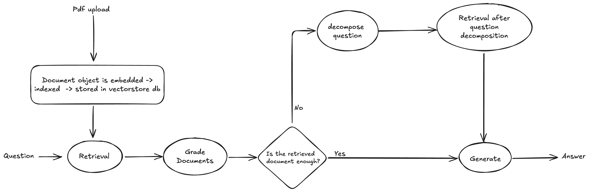

## Multihop RAG
This repository contains an attempt at implementation of Multihop RAG. The implementation is done by creating an agentic workflow using *LangGraph*.

Among the multiple ways of implementing Multihop RAG, I have primarily used the method of Query Decomposition, to generate answers for questions with multiple hops. 

Below is a graphical diagram showing the workflow: 

